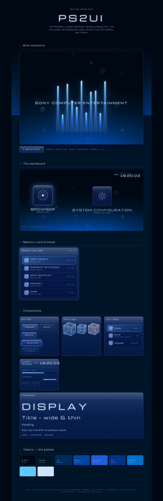

# PS2UI

**The PlayStation 2 system dashboard, rebuilt 1:1 as a TypeScript/React UI kit** — the boot
screen, the floating data-cubes, the Emotion-Engine blue — so the PS2 *look and feel* run on
every platform the web reaches.

Reverse-engineered from a sourced teardown of the PS2 BIOS dashboard ("Browser" + "System
Configuration"), the boot sequence (the rising towers of light, the drifting translucent
"sand"), and the memory-card browser — cross-referenced against the UI/HUD language of the
PS2-exclusive canon (Shadow of the Colossus, MGS2/3, FFX/XII, Persona, Okami, Rez…) and the
2000–2006 "Frutiger Aero / chrome-and-glass" lineage. Every value is sourced — see
[`research/`](./research) for the evidence: the per-claim findings notes and the distilled
[design spec](./research/DESIGN.md).



## Install

```bash
npm install ps2ui react react-dom
```

`ps2ui` is a standard ESM + TypeScript package (React 18 / 19 are peer deps). It works in
**Next.js** (App Router & Pages), Vite, Remix, CRA — any React + bundler setup. Components that
need interactivity ship their own `"use client"` directive; the only required step is importing
the stylesheet once.

### Next.js (App Router)

```tsx
// app/layout.tsx
import "ps2ui/styles.css";

export default function RootLayout({ children }: { children: React.ReactNode }) {
  return (
    <html lang="en">
      <body>{children}</body>
    </html>
  );
}
```

`ps2ui/styles.css` loads the design tokens + the base scene layer; per-component CSS is bundled
automatically. The tokens alone are exported as `ps2ui/tokens.css`. A nice closer font pairing
(the demo uses it) — load **Inter**, **Exo 2**, and **Michroma** from Google Fonts; the kit falls
back to a system stack without them.

## Usage

```tsx
import { PS2Provider, MainMenu, BootScreen, Cube, Button } from "ps2ui";

export default function App() {
  return (
    <PS2Provider asRoot scene="browser">
      <BootScreen wordmark="Sony Computer Entertainment" towers={11} />
      <MainMenu
        items={[
          { id: "browser", label: "Browser", caption: "Memory Card", icon: <Cube /> },
          { id: "config", label: "System Configuration", caption: "Console settings" },
        ]}
      />
      <Button selected icon="▸">Start</Button>
    </PS2Provider>
  );
}
```

Everything is **pure CSS variables** — zero runtime, SSR-safe. Override any `--ps2-*` token on
`:root` (or pass `tint` to `PS2Provider`) to reskin.

## Components

| | |
|---|---|
| **`BootScreen`** | the boot sequence — towers of light (one per saved title), drifting data-cubes, the four △○✕□ comets, fading wordmark |
| **`MainMenu`** | the dashboard — drifting blue field, clock, floating menu tiles |
| **`MemoryCardBrowser`** | the saves browser — a glass command-box of rows |
| **`Cube`** | the iconic translucent tumbling data-cube (pure CSS 3D) |
| **`AmbientBackground`** | the drifting "sand" field on the blue gradient |
| **`IconTile`** | a large dashboard menu tile with a floating glyph |
| **`Surface` / `Panel`** | the glass command-box substrate, with sheen + bloom |
| **`Button`** | glossy blue chrome button — blooms on focus, glides on selection |
| **`List` / `Row`** | inset-grouped memory-card rows (leading icon · label · trailing value) |
| **`Clock`** | the dashboard clock (orbs + BIOS readout) |
| **`Progress`** | a status bar with the era's top-highlight streak |
| **`Text`** | BIOS typography (display / title / heading / body / label / caption) |

## Architecture

```
src/
  tokens/        # the design system: variables.css (~70 CSS custom properties —
                 #   the PlayStation blues, glass, bloom, type ramp, motion timings)
                 #   + tokens.ts (typed mirror)
  system/        # environment.tsx (PS2Provider + usePS2) · types.ts
  components/    # Text, Surface, Panel, Button, Cube, IconTile, List/Row, Clock,
                 #   Progress, AmbientBackground, BootScreen — each with co-located CSS
  blocks/        # composed templates: MainMenu (dashboard), MemoryCardBrowser
  styles/        # ps2ui.css (the single import) + globals.css (the scene base)
app/             # the live demo gallery (Next.js)
research/        # the reverse-engineering evidence this kit was built from:
                 #   DESIGN.md (the spec) + notes/*-findings.md (sourced, per-claim)
```

**Styling** is pure CSS variables — zero runtime, SSR-safe, portable to any React setup.
**Motion** follows the PS2's slow, weighted feel (ease-out-expo glide, ~14s ambient drift) and
honors `prefers-reduced-motion`. The library build (`tsup`, `bundle: false`) transpiles each
source file in place so every `"use client"` directive and CSS import survives into `dist/`.

## How it was built

1. **Research** — a three-stream sweep (system software · PS2-exclusive game UI · the era's
   design DNA) into sourced findings notes, distilled into [`research/DESIGN.md`](./research/DESIGN.md).
2. **Tokens** — the palette, type, and motion derived from the findings → `tokens/variables.css`.
3. **Components** — the glass `Surface` base, then every component on top.
4. **Blocks + gallery** — the dashboard / memory-card templates and a live demo gallery.
5. **Fidelity loop** — screenshot the gallery, diff against the PS2 BIOS, fix, repeat.

## Fidelity & honest gaps

Built to *evoke* the PS2, not to clone Sony assets:

- **No official teardown exists** of the PS2 boot's exact hex/font. The system-software values
  are best-estimate reconstructions corroborated across community sources; the brand blues
  (`#003087` Resolution Blue, `#006fcd` True Blue) and the game-UI patterns are well-sourced.
- **Fonts** — the BIOS used Sony's corporate neo-grotesque (≈ Helvetica bitmap). The kit defaults
  to a free stack (**Inter / Roboto**) for body and a wide geometric (**Michroma / Exo 2**) for
  display. Visually close, not identical.
- **Glass / bloom** — `backdrop-filter: blur()` + layered glows approximate the console's
  volumetric light. It is the costliest per-frame CSS op — cap simultaneous glass panels and
  lower blur on mobile. Thin glowing text on gradients can fail WCAG contrast; keep the
  high-contrast text token and test.

## Develop PS2UI itself

This repo is both the **library** (`src/`) and a **demo gallery** (`app/`).

```bash
npm install
npm run dev          # http://localhost:3000 — the live component gallery
npm run build        # build the publishable library → dist/ (tsup ESM + tsc .d.ts + CSS)
npm run typecheck    # tsc --noEmit
npm run demo:build   # build the gallery as a static Next.js site
```

## License

MIT. **PlayStation** and **PlayStation 2** are trademarks of Sony Interactive Entertainment Inc.;
this is an independent, clean-room-style reimagining for the web and ships **no Sony assets**.
